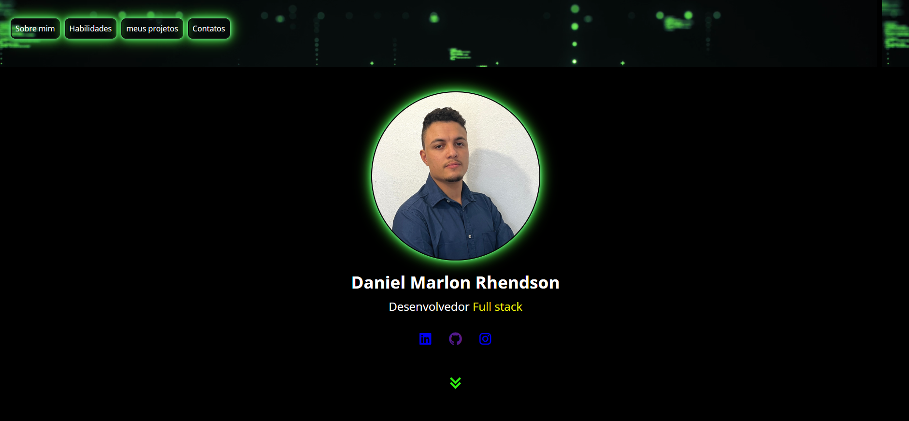

# Projeto

Bem-vindo ao meu portfólio! Sou um desenvolvedor apaixonado por criar interfaces modernas e responsivas, utilizando HTML, CSS e JavaScript. Aqui estão alguns dos projetos que refletem minha dedicação em transformar ideias em experiências interativas e atraentes.

## 🚀 Tecnologias Principais:

- HTML5: Estruturação semântica e acessível. 
- CSS3: Estilos responsivos e animações.
- JS: Manipulando a pagina.

## Contato
[linkedin](https://www.linkedin.com/in/daniel-alves-9872392a7/)